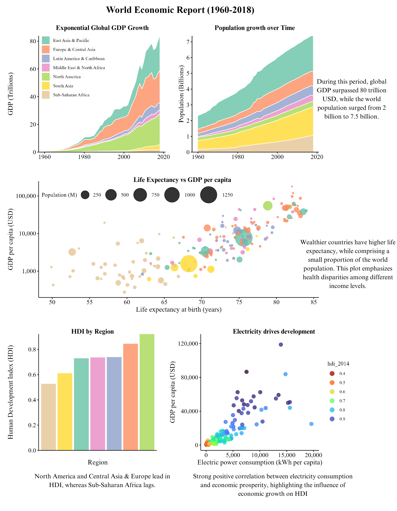

# World Economic Report (1960-2018)

This project explores global economic development trends from 1960 to 2018, focusing on the relationship between key economic indicators and human development. The analysis provides insights into global trends and regional disparities.

Visualizations generated are integrated into a one-page infographic-style report, highlighting trends in global growth and development.

The datasets used in this analysis (`WorldBank.xlsx` and `HDI.csv`) are included in this repository.

## Report
The final output of this project is a one-page infographic-style report that visually summarizes the key findings.

